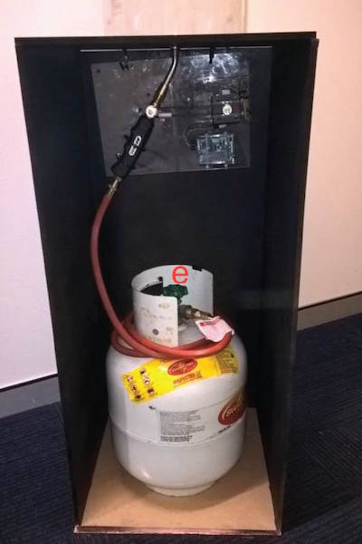

The is the repository for the SizzleRig™ Rails backend.

## Introduction

This website is developed as part of our submission for GovHack 2016. The 'SizzleRig' project involves analysis of bushfire data from national, state and territory governments. With machine learning tools we have developed a system for rating the threat of bushfire for any location in Australia that includes historical and real-time data from CSIRO's Sentinel HotSpots satellite programme.

## The Project

The SizzleRig™ is composed of two sections, a web application and a hardware visualizer. Made with love for GovHack 2016

### The Web Application

The web application for [SizzleRig.com](http://sizzlerig.com) (stored in this repository), is a standard Rails 5 installation using a SQLite database. It houses the code used to wrangle the datasets into a managable format. Once the data is successfully scraped and prepped, the web application frontend is able to make requests to visualize the data on a map of australia using Google Maps. 

### The Hardware Visualizer



The hardware visualizers a modified "flamethrower" (featured above). We thinks its safe (promise). The uses a LPG gas tank connected a nozzle. This is wired to a Arduino along with a stepper motor so that the gas flow can be controlled remotely. Processed data from the web app is sent to the Arduino where the gas is controlled to provide a visualization of the data. The source code for the Arduino can be found in the `src` folder.

## How To Use

- Install Ruby with your favorite version manager (We like RVM), the project has no Ruby version lock, but is was tested with `2.3.1`
- Install the gems using `bundler` 
- Create and setup the databases using the standard rake tasks:

```bash
rake db:create && rake db:schema:load
```
- Seed the database with required data using `rake data:seed_sentinel`
- Run up the server using `rails s` and have fun

Of course, you could also just go to the [live website](http://sizzlerig.com)

## Final Thoughts

Our team had fun putting this together, and we hope you have fun using it. Remember friends, Stay Squiggly :)
